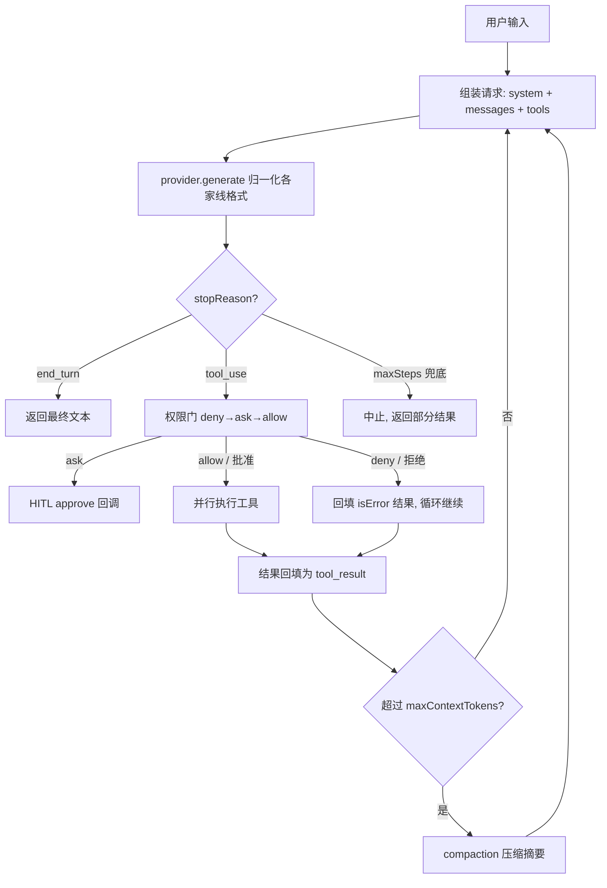

# 新读者导览（Reader's Guide）

> 这份导览帮你在几分钟内看懂 super-agent 这个项目：它是什么、文档怎么读、代码怎么找、
> 每个阶段学到什么。代码和代码注释是英文，设计/研究文档是中文。
>
> 顶层入口：[README（English）](../README.md) · [README（中文）](../README.zh-CN.md)

---

## 1. 这是什么

一个用 **TypeScript + Bun 从零手写**的通用任务 agent，为了**在动手中学习 agent 架构**。
它不是一个产品，而是一条学习路径：先调研市面主流 agent（Claude Code、Codex CLI、OpenClaw、
Hermes）的架构与原理，再把每一条原理亲手实现、测试验证。最终得到一个能**多步自主推理、
可插拔多后端、有权限安全、能管理上下文、接得上工具生态、能派生子代理、能自我沉淀技能**的 agent。

一句话记住内核：**agent = 一个把"下一步做什么"交给模型决定的 while 循环**。

---

## 2. 三条阅读路径

**A. 我想学 agent 原理** →
1. [`agent-research.md`](agent-research.md) §0（一页看懂）→ §2（Agent Loop）→ §4（六大子系统）
2. 本导览 §4（一次 run 发生了什么）
3. 挑一个你好奇的概念，跳到 §6 的对照表，直接读它的实现和测试

**B. 我想读代码** →
1. 本导览 §5（代码地图）
2. `src/core/types.ts`（数据模型，一切的基础）→ `src/core/engine.ts`（循环本体）
3. 顺着 §6 对照表，一个阶段一个阶段读 `src/` + `test/`

**C. 我想先跑起来** →
1. [README](../README.zh-CN.md) 的「安装 / 运行」
2. `bun test` 看 75 个测试怎么验证每个能力（不联网）
3. 配一个 key，`bun run agent "列出 src/ 目录，然后解释 engine.ts 做什么"`，看它自己多步干活

---

## 3. 文档地图

| 文件 | 是什么 | 什么时候读 |
|---|---|---|
| [`agent-research.md`](agent-research.md) | 四款主流 agent 架构调研 + 通用原理 + 可复用工程清单 | 想理解"为什么这么设计" |
| [`our-agent-design.md`](our-agent-design.md) | 我们自己的架构设计 + 8 阶段构建计划 + 数据模型/伪码 | 想理解"我们打算怎么做" |
| [`agent-comparison.html`](agent-comparison.html) | 四款 agent 的可视化横向对比页 | 想 5 分钟建立全局认知 |
| `GUIDE.md`（本文件） | 新读者导览：把上面几份和代码串起来 | 现在 |
| `agents/` | 工程技能（mattpocock skills）的仓库配置 | 用到那些技能时 |

---

## 4. 一次 run 发生了什么

调用 `runAgent(userInput, opts)`（[`src/core/engine.ts`](../src/core/engine.ts)）后：



每一步都同时发生两件事：**发类型化事件**（`turn_start` / `tool_call` / `tool_result` /
`permission_decision` / `compaction` / `done`…，供 CLI/日志订阅）+ 可选**写入 rollout**
（append-only JSONL 会话文件）。

关键不变量：
- 循环只在模型返回 `end_turn`（不再要工具）时正常结束，`maxSteps` 兜底防跑飞；
- 工具报错**不崩循环**——错误作为 `tool_result` 回填，让模型自己纠正；
- 权限由**引擎强制**，不是靠 prompt 说服模型；
- 压缩发生在两步**之间**，且**防孤儿切割**（不拆开 `tool_use`/`tool_result` 配对）。

---

## 5. 代码地图

```
src/
├─ core/         循环、数据模型、事件、压缩 —— agent 的"发动机"
├─ providers/    ModelProvider 抽象 + OpenAI/Anthropic adapter + 工厂 —— 可插拔后端的接缝
├─ permissions/  PermissionPolicy —— 决定每个工具调用 allow/ask/deny
├─ tools/        registry + 内置工具（read_file/list_dir/write_file）+ 工作区边界
├─ session/      rollout —— 会话持久化
├─ mcp/          手写 MCP 客户端 + 把 MCP 工具注册进 registry
├─ agents/       subagent —— spawn_agent 工具（隔离的子 agent）
├─ skills/       SkillStore + find/read/create_skill 工具（可复用流程文档、自我扩展）
└─ cli/          终端前端（引擎的"瘦客户端"，渲染事件流）
```

**最该先读的三个文件：**
1. [`core/types.ts`](../src/core/types.ts) —— `Message` / `ContentBlock` / `AssistantTurn` /
   `ToolSpec`。整个系统都用这套 provider-中立的类型；看懂它，别的都好懂。
2. [`core/engine.ts`](../src/core/engine.ts) —— `runAgent`。循环本体、权限门集成、压缩钩子都在这。
3. [`tools/registry.ts`](../src/tools/registry.ts) —— `defineTool`：一份 Zod schema 同时生成
   给模型看的 JSON Schema 和运行期校验器（二者永不脱节）。

**设计接缝（为什么能优雅扩展）：**
- 引擎只依赖 `ModelProvider` 接口 → 加后端不动引擎（P6 就是证据：引擎测试一行没改）。
- 所有工具（原生 / MCP / 子代理）都是 `RegisteredTool`，走同一条注册 + 权限 + 执行管道。
- 前端只订阅事件流，不碰引擎内部 → 将来换 TUI/HTTP 前端都行。

---

## 6. 八阶段 × 原理 × 代码 × 测试

想深入某个能力，从这张表直接跳到它的实现和测试：

| 阶段 | 原理（研究章节） | 实现 | 测试 |
|---|---|---|---|
| P1 骨架 | 线协议、tool 往返（§2、§4.1） | `core/types.ts` `providers/openai.ts` | `openai-normalize.test.ts` |
| P2 循环 | ReAct、turn/step、终止（§2） | `core/engine.ts` | `engine.test.ts` |
| P4 上下文 | context rot、compaction、外部记忆（§4.2） | `core/compaction.ts` `session/rollout.ts` | `compaction.test.ts` `rollout.test.ts` `engine-context.test.ts` |
| P5 权限 | 两层强制、致命三要素（§4.5） | `permissions/gate.ts` `tools/workspace.ts` `tools/write-file.ts` | `gate.test.ts` `workspace.test.ts` `engine-permissions.test.ts` |
| P6 多后端 | provider 归一化、可插拔（§4.6） | `providers/anthropic.ts` `providers/factory.ts` | `anthropic-normalize.test.ts` `factory.test.ts` |
| P7 MCP | JSON-RPC、tools/list 聚合（§4.6） | `mcp/client.ts` `mcp/register.ts` | `mcp-client.test.ts` `mcp-register.test.ts` |
| P8 子代理 | 上下文隔离、orchestrator-worker（§4.4） | `agents/subagent.ts` | `subagent.test.ts` |
| P9 技能 | 自我扩展、skills ≠ tools（§3.3、研究里各 agent 的 skills 设计） | `skills/store.ts` `skills/tools.ts` | `skills-store.test.ts` `skills-tools.test.ts` |

每个阶段对应一个 GitHub issue 和一个 squash 合并的 PR，提交历史本身就是一条清晰的学习时间线
（`git log --oneline`）。

---

## 7. 怎么扩展

**加一个工具**（最常见）：用 `defineTool` 写一个，注册进 registry。示例见
[`tools/read-file.ts`](../src/tools/read-file.ts)。给它合适的 `risk`（`low` 免问、
`medium`/`high` 默认要审批），文件类工具用 `resolveInWorkspace(ctx, path)` 守住工作区边界。

**加一个后端**：实现 `ModelProvider`（一个 `generate(req)` 方法），在 adapter 里把该家的
线格式归一化成我们的类型；在 `factory.ts` 里登记。引擎不用动。参考
[`providers/anthropic.ts`](../src/providers/anthropic.ts)。

**接一个 MCP 服务器**：在当前目录放 `mcp.json`（见 `mcp.json.example`）。CLI 启动时会连接、
把它的工具注册进 registry（命名空间 `mcp__<server>__<tool>`，默认 `high` 风险）。

**给子代理换工具集**：`createSubagentTool({ tools, maxDepth, ... })`，`tools` 决定子代理能用什么，
`maxDepth` 控制递归层数（默认 1 = 子代理是叶子）。见 [`agents/subagent.ts`](../src/agents/subagent.ts)。

**加/用技能**：技能是 `.agent/skills/<name>/SKILL.md`（frontmatter + 正文）。agent 用
`find_skill` 发现、`read_skill` 加载、`create_skill` 自己写新技能（写操作受权限门管辖）。
默认已集成；换目录用 `AGENT_SKILLS_DIR`。见 [`skills/`](../src/skills/)。

---

## 8. 词汇表

- **Turn（轮）**：一次模型推理（一个请求 → 一条 assistant 消息）。想调工具的轮以 `tool_use` 结束。
- **Step（步）**：一次完整循环迭代 = 模型轮 → 执行工具 → 回填结果。一步可并行执行多个工具。
- **`tool_use` / `tool_result`**：模型请求调用工具的块 / 工具执行结果的块，靠共享 id 配对。
- **`stopReason`**：模型为何停下（`end_turn` / `tool_use` / `max_tokens` / `stop_sequence`），
  各家线格式归一化到这个联合类型。
- **Compaction（压缩）**：接近上下文预算时把旧历史摘要成一条消息、保留近期尾部。
- **HITL**：human-in-the-loop，高风险工具执行前暂停、请人批准。
- **MCP**：Model Context Protocol，连接外部工具/数据服务器的开放标准。
- **致命三要素**：一个 agent 同时拥有(1)访问私有数据 (2)接触不可信内容 (3)对外通信 时可被注入攻击外泄——
  我们用工作区边界等手段限制爆炸半径。

---

## 9. 已知边界（有意延后）

诚实标注、没做的部分：本地（Ollama/LM Studio）后端、流式输出、`bash` 工具、
内容级提示注入扫描、MCP HTTP 传输、把已存会话 resume 回活循环、压缩后自动重注入 notes/todo。
每一项在 [`our-agent-design.md`](our-agent-design.md) 和相应 PR 里都注明了原因。
