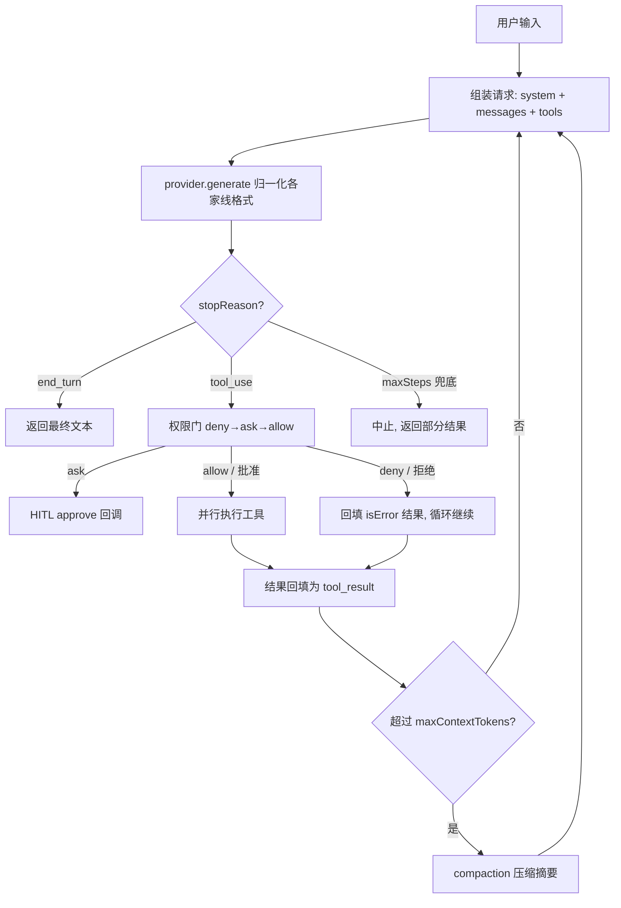

# 新读者导览（Reader's Guide）

> 这份导览帮你在几分钟内看懂 super-agent 这个项目：它是什么、文档怎么读、代码怎么找、
> 每个阶段学到什么。代码和代码注释是英文，设计/研究文档是中文。
>
> 顶层入口：[README（English）](../README.md) · [README（中文）](../README.zh-CN.md)

---

## 1. 这是什么

一个用 **TypeScript + Bun 从零手写**的通用任务 agent，为了**在动手中学习 agent 架构**。
它不是一个产品，而是一条学习路径：先调研市面主流 agent（Claude Code、Codex CLI、OpenClaw、
Hermes）的架构与原理，再把每一条原理亲手实现、测试验证。最终得到一个能**多步自主推理、
可插拔多后端、有权限安全、能管理上下文、接得上工具生态、能派生子代理、能自我沉淀技能**的 agent。

一句话记住内核：**agent = 一个把"下一步做什么"交给模型决定的 while 循环**。

---

## 2. 三条阅读路径

**A. 我想学 agent 原理** →
1. [`agent-research.md`](agent-research.md) §0（一页看懂）→ §2（Agent Loop）→ §4（六大子系统）
2. 本导览 §4（一次 run 发生了什么）
3. 挑一个你好奇的概念，跳到 §6 的对照表，直接读它的实现和测试

**B. 我想读代码** →
1. 本导览 §5（代码地图）
2. `src/core/types.ts`（数据模型，一切的基础）→ `src/core/engine.ts`（循环本体）
3. 顺着 §6 对照表，一个阶段一个阶段读 `src/` + `test/`

**C. 我想先跑起来** →
1. [README](../README.zh-CN.md) 的「安装 / 运行」
2. `bun test` 看 145 个测试怎么验证每个能力（不联网）
3. 配一个 key，`bun run agent "列出 src/ 目录，然后解释 engine.ts 做什么"`，看它自己多步干活
4. 想要常驻多轮对话：`bun run tui`（交互式 REPL，`/exit` 退出，`Ctrl-C` 中断当前任务）

---

## 3. 文档地图

| 文件 | 是什么 | 什么时候读 |
|---|---|---|
| [`agent-research.md`](agent-research.md) | 四款主流 agent 架构调研 + 通用原理 + 可复用工程清单 | 想理解"为什么这么设计" |
| [`our-agent-design.md`](our-agent-design.md) | 我们自己的架构设计 + 8 阶段构建计划 + 数据模型/伪码 | 想理解"我们打算怎么做" |
| [`agent-comparison.html`](agent-comparison.html) | 四款 agent 的可视化横向对比页 | 想 5 分钟建立全局认知 |
| `GUIDE.md`（本文件） | 新读者导览：把上面几份和代码串起来 | 现在 |
| [`adr/`](adr/) | 架构决策记录（ADR）：一处决策一份，含背景/取舍/后果 | 改动某块前，读相关 ADR（TUI 见 [`0001`](adr/0001-interactive-tui-frontend.md)、流式见 [`0002`](adr/0002-token-streaming.md)） |
| `agents/` | 工程技能（mattpocock skills）的仓库配置 | 用到那些技能时 |

---

## 4. 一次 run 发生了什么

调用 `runAgent(userInput, opts)`（[`src/core/engine.ts`](../src/core/engine.ts)）后：



每一步都同时发生两件事：**发类型化事件**（`turn_start` / `tool_call` / `tool_result` /
`permission_decision` / `compaction` / `cancelled` / `text_delta`（流式）/ `done`…，供
CLI/TUI/日志订阅）+ 可选**写入 rollout**（append-only JSONL 会话文件）。

关键不变量：
- 循环只在模型返回 `end_turn`（不再要工具）时正常结束，`maxSteps` 兜底防跑飞；
- 工具报错**不崩循环**——错误作为 `tool_result` 回填，让模型自己纠正；
- 权限由**引擎强制**，不是靠 prompt 说服模型；
- 压缩发生在两步**之间**，且**防孤儿切割**（不拆开 `tool_use`/`tool_result` 配对）。

---

## 5. 代码地图

```
src/
├─ core/         循环、数据模型、事件、压缩 —— agent 的"发动机"
├─ providers/    ModelProvider 抽象 + OpenAI/Anthropic adapter + 工厂 —— 可插拔后端的接缝
├─ permissions/  PermissionPolicy —— 决定每个工具调用 allow/ask/deny
├─ tools/        registry + 内置工具（read_file/list_dir/write_file）+ 工作区边界
├─ session/      rollout —— 会话持久化
├─ mcp/          手写 MCP 客户端 + 把 MCP 工具注册进 registry
├─ agents/       subagent —— spawn_agent 工具（隔离的子 agent）
├─ skills/       SkillStore + find/read/create_skill 工具（可复用流程文档、自我扩展）
├─ runtime/      bootstrap —— 会话级装配（provider/registry/policy/工具），CLI 与 TUI 共用
├─ cli/          一次性终端前端（`bun run agent`，引擎的"瘦客户端"，渲染事件流）
└─ tui/          交互式 REPL 前端（`bun run tui`）：渲染层 + 输入循环 + 审批模态
```

**最该先读的三个文件：**
1. [`core/types.ts`](../src/core/types.ts) —— `Message` / `ContentBlock` / `AssistantTurn` /
   `ToolSpec`。整个系统都用这套 provider-中立的类型；看懂它，别的都好懂。
2. [`core/engine.ts`](../src/core/engine.ts) —— `runAgent`。循环本体、权限门集成、压缩钩子都在这。
3. [`tools/registry.ts`](../src/tools/registry.ts) —— `defineTool`：一份 Zod schema 同时生成
   给模型看的 JSON Schema 和运行期校验器（二者永不脱节）。

**设计接缝（为什么能优雅扩展）：**
- 引擎只依赖 `ModelProvider` 接口 → 加后端不动引擎（P6 就是证据：引擎测试一行没改）。
- 所有工具（原生 / MCP / 子代理）都是 `RegisteredTool`，走同一条注册 + 权限 + 执行管道。
- 前端只订阅事件流 + 提供一个 `approve` 回调，不碰引擎内部 → 加前端不动引擎（P11 就是证据：
  交互式 TUI 与一次性 CLI 共用同一引擎，引擎只多了可选的 `history`/`signal` 字段）。详见 §7。

---

## 6. 各阶段 × 原理 × 代码 × 测试

想深入某个能力，从这张表直接跳到它的实现和测试：

| 阶段 | 原理（研究章节） | 实现 | 测试 |
|---|---|---|---|
| P1 骨架 | 线协议、tool 往返（§2、§4.1） | `core/types.ts` `providers/openai.ts` | `openai-normalize.test.ts` |
| P2 循环 | ReAct、turn/step、终止（§2） | `core/engine.ts` | `engine.test.ts` |
| P4 上下文 | context rot、compaction、外部记忆（§4.2） | `core/compaction.ts` `session/rollout.ts` | `compaction.test.ts` `rollout.test.ts` `engine-context.test.ts` |
| P5 权限 | 两层强制、致命三要素（§4.5） | `permissions/gate.ts` `tools/workspace.ts` `tools/write-file.ts` | `gate.test.ts` `workspace.test.ts` `engine-permissions.test.ts` |
| P6 多后端 | provider 归一化、可插拔（§4.6） | `providers/anthropic.ts` `providers/factory.ts` | `anthropic-normalize.test.ts` `factory.test.ts` |
| P7 MCP | JSON-RPC、tools/list 聚合（§4.6） | `mcp/client.ts` `mcp/register.ts` | `mcp-client.test.ts` `mcp-register.test.ts` |
| P8 子代理 | 上下文隔离、orchestrator-worker（§4.4） | `agents/subagent.ts` | `subagent.test.ts` |
| P9 技能 | 自我扩展、skills ≠ tools（§3.3、研究里各 agent 的 skills 设计） | `skills/store.ts` `skills/tools.ts` | `skills-store.test.ts` `skills-tools.test.ts` |
| P10 Azure 后端 | api-key 鉴权、api-version、deployment（§4.6 可插拔） | `providers/azure.ts` | `azure.test.ts` |
| P11 交互式 TUI | 前端瘦客户端、事件流、UI 无关（[ADR-0001](adr/0001-interactive-tui-frontend.md)） | `tui/*` `runtime/bootstrap.ts` `core/engine.ts`（`history`/`signal`） | `transcript.test.ts` `tui-app.test.ts` `bootstrap.test.ts` `engine-multiturn.test.ts` `inflight-abort.test.ts` |
| P12 流式渲染 | 事件流实时逐字、opt-in 加法式、子行 vs 前缀稳定（[ADR-0002](adr/0002-token-streaming.md)） | `providers/*`（`stream()`）`core/engine.ts`（`stream`）`tui/app.ts`（volatile `pending`） | `streaming.test.ts` `streaming-adapters.test.ts` `tui-app.test.ts` |

每个阶段对应一个 GitHub issue 和一个 squash 合并的 PR，提交历史本身就是一条清晰的学习时间线
（`git log --oneline`）。P11 拆成五个子 PR（P-tui-1..5）、P12 拆成三个（P12-1..3），每步独立可测——见 §7。

---

## 7. 交互式 TUI：这条线学到了什么

P11 在**不改变"agent 是什么"**的前提下，给引擎加了第二个前端：一个常驻多轮的 REPL
（`bun run tui`）。它是"前端瘦客户端"这条设计原则的最佳案例，也踩出了几个**改了会静默出错**的坑。
完整决策与后果记录见 [`adr/0001-interactive-tui-frontend.md`](adr/0001-interactive-tui-frontend.md)。

**怎么拆的**：先立 ADR + PRD，再分五个小步、每步独立 PR + 独立测试：

1. **引擎接缝**：`history`（多轮续接）+ `signal`（取消）——都是可选、向后兼容字段
2. **共享 bootstrap**：provider/registry/policy/工具装配收到一处，CLI 与 TUI 共用
3. **渲染层**：事件 → 终端行（纯函数，可测）
4. **REPL app**：输入循环 + 审批模态 + Ctrl-C
5. **飞行中取消**：`AbortSignal` 穿到 provider，模型调用秒断

**可迁移的经验（也是几个真踩过的坑）：**

- **前端只碰事件流 + 一个 `approve` 回调，引擎保持 UI 无关。** 加 TUI 没动引擎循环本身——
  正如 P6 加后端没动引擎。引擎的每处新增都是可选字段，一次性 CLI 一行没改。
- **多轮续接要守住 rollout 的"增量契约"。** 只记录**新增**（新 user 消息 + 本轮产出），meta
  每会话一次。天真地重记 `messages[0]` 会重复旧消息、漏记新输入、每轮多写 meta，把会话文件写坏。
- **`done` 和最终答案的 `text` 是同一份，别打印两遍。** 渲染 `text`（含中间叙述），把 `done`
  当纯终止标记；代价是终答不再加粗（`text` 事件无从区分终答与叙述）。子 agent 的答案也因此
  必须走它自己的 `text` 事件（缩进），而不是旧 CLI 那样只显示 `done`。
- **渲染按"每事件一行"、只追加、前缀稳定。** 两个工具乱序返回时，整模型重渲染会重排已打印的行；
  逐事件追加天然安全——于是 transcript 状态干脆就是渲染好的行缓冲，没有会和屏幕脱节的影子模型。
- **"始终允许"要一个会话级 policy。** approver 的 `a` 要跨轮生效，policy 必须是 bootstrap 里
  创建、CLI/TUI/子 agent 共享的同一个实例（像注入 provider 一样注入它）。
- **被打断的轮次不推进对话。** `cancelled` / `max_steps` 会留下一条尾随的 user 角色消息；直接
  当历史再拼下一个 user 输入 → 两条连续 user 消息（provider 拒收）。所以只在 `end_turn` 时推进
  历史，被中断的轮只留在 rollout 里（因此 rollout 是历史的超集——将来做 resume 需清洗）。
- **审批要串行化——这是安全问题，不是体验问题。** 并行的 `spawn_agent` 会让两个子 agent 同时
  触发同一个审批提示，抢占可能把批准落到错误的工具上（而 approve 是写操作的闸门）。用一条
  promise 链让审批严格逐个弹出。
- **取消按"信号状态"判定，不按错误类型。** 飞行中 abort 时各家 SDK 抛的错误类型不同；只要
  `signal.aborted` 为真就算取消——provider 无关，也不怕 SDK 换错误类。两个模型调用点都要覆盖：
  每轮生成**和**压缩摘要。

**给测试留缝**：REPL 循环把 I/O（`readLine` / `printer` / `approve` / `signal`）全**注入**，于是能用
脚本化 provider 在**无终端、无网络**下集成测试多轮穿线、取消回退、rollout 孤儿等真实路径。终端胶水
（raw readline、SIGINT）是有意留薄、不单测的一层——逻辑都下沉到可测的 reducer / approver。

**仍留的 v1 边界**（见 ADR §3/§5）：审批提示处按 Ctrl-C 是"粘"的（用 `n` 拒绝更快）；真实 TTY 下
Ctrl-C 的手感需要在真终端里人肉验一次（CI 无法复现）。（按轮渲染的局限已由 P12 流式解掉，见下。）

### 流式渲染（P12）：在不破坏上面的前提下加实时逐字

P12 让 `bun run tui` 逐 token 渲染答案。难点不是线协议，而是**流式打破了 P11 渲染层的"前缀稳定、
只追加"不变量**（token 是子行的）。决策见 [`adr/0002-token-streaming.md`](adr/0002-token-streaming.md)。
同样三步：接缝/引擎/事件 → 三 adapter 真实流式 → TUI volatile 渲染。

**可迁移的经验（也是几个真踩过的坑）：**

- **流式是 opt-in + 加法式。** `RunOptions.stream` 显式开；引擎流式模式下**仍发 `done` 带全文**——
  所以 CLI 和所有非 delta 消费者零改动。没 `stream()` 的 provider 自动回退 `generate()`。
- **接缝复用同一套路**（像加后端/加前端）：`stream?()` 产出 `text_delta` + 终结 `done{turn}`，
  adapter 在 `done` 里交出**完全归一化**的 turn，引擎不见厂商形状。
- **别手搓工具重组。** 复用 SDK 自己的 `finalChatCompletion()` / `finalMessage()` 拿到组装好的
  最终结果，再喂给**现有**归一化器——工具重组走 SDK 的成熟路径，不重写。
- **子行 delta vs 前缀稳定缓冲的张力（核心）。** committed 缓冲原样保留（整行）；另加一个 volatile
  `pending`：delta 原样写 + 累积，**任何整行事件之前先 flush-commit `pending`**。这条"整行事件前
  先提交"就是全部正确性所在（P11 的 done/text 去重的流式版）。
- **原生 sink 的连带效应。** printer 自己管换行（才能发子行 delta），于是**任何直接写终端**
  （如 Ctrl-C 的 `⏹ interrupting…`）都必须先 flush `pending`，否则会粘到半个 token 上——统一走
  `printer.notice`。这是原生 sink 引入的新回归，靠这条规则堵住。
- **`include_usage` 坑。** OpenAI/Azure 流式默认不返回 usage，要在**流式请求**里显式加
  `stream_options:{include_usage:true}`（非流式 `create` 会拒），否则 `done` turn 的 token 计数是 0。
  Anthropic 的 `finalMessage()` 自带。
- **子 agent 不流式、取消按信号状态判定**——都沿用 P11 的决策：子行缩进无解 → 干脆不流式；
  abort 检测 provider 无关，且这条新路径也复用了 `runTurn` 的 abort 兜底。

**v1 边界**：只流**文本**（工具整块随 `done` 到）；真实网络的 usage 与流式中途 Ctrl-C 的观感各欠
一次人验（断言已备，见 ADR-0002）。

---

## 8. 怎么扩展

**加一个工具**（最常见）：用 `defineTool` 写一个，注册进 registry。示例见
[`tools/read-file.ts`](../src/tools/read-file.ts)。给它合适的 `risk`（`low` 免问、
`medium`/`high` 默认要审批），文件类工具用 `resolveInWorkspace(ctx, path)` 守住工作区边界。

> **`risk` 一身兼二职，改它要想清楚（真踩过的坑）。** 权限门里 `risk` 同时决定两件事:
> `default` 模式**是否要审批**(`low` 直接跑),以及 `readonly` 模式**是否放行**(只放 `low`)。
> 也就是说 `risk` 把"**有多危险**"和"**会不会改文件系统**"两个维度压成了一个。所以把
> `write_file` 从 `high` 降到 `low`(让它默认不再打断用户),连带就让 `readonly` 也不再拦它了
> ——readonly 失去了"禁写"的语义。若要既默认免问、又能被 readonly 挡住,得给工具加一个独立的
> "是否修改状态"标记,让 `readonly` 按它拦截,而不是只看 `risk`。审批面向用户的体验则另有开关:
> TUI 的"始终允许"(`a`)、web 弹窗的 **Always allow**,底层都是 `policy.allowForSession()`。

**加一个后端**：实现 `ModelProvider`（一个 `generate(req)` 方法），在 adapter 里把该家的
线格式归一化成我们的类型；在 `factory.ts` 里登记。引擎不用动。参考
[`providers/anthropic.ts`](../src/providers/anthropic.ts)。若某家和 OpenAI 线格式相同
（如 Azure OpenAI），可直接**复用** OpenAI 的归一化函数、只改客户端构造——见
[`providers/azure.ts`](../src/providers/azure.ts)。

**接一个 MCP 服务器**：在当前目录放 `mcp.json`（见 `mcp.json.example`）。CLI 启动时会连接、
把它的工具注册进 registry（命名空间 `mcp__<server>__<tool>`，默认 `high` 风险）。

**给子代理换工具集**：`createSubagentTool({ tools, maxDepth, ... })`，`tools` 决定子代理能用什么，
`maxDepth` 控制递归层数（默认 1 = 子代理是叶子）。见 [`agents/subagent.ts`](../src/agents/subagent.ts)。

**加/用技能**：技能是 `.agent/skills/<name>/SKILL.md`（frontmatter + 正文）。agent 用
`find_skill` 发现、`read_skill` 加载、`create_skill` 自己写新技能（写操作受权限门管辖）。
默认已集成；换目录用 `AGENT_SKILLS_DIR`。见 [`skills/`](../src/skills/)。

**加一个前端**（如 HTTP/SDK）：用 `bootstrap()`（[`runtime/bootstrap.ts`](../src/runtime/bootstrap.ts)）
拿到装配好的 `Runtime`，订阅 `runAgent` 的事件流渲染，提供一个 `approve` 回调；多轮就把上轮
`result.messages` 当下轮 `history`。把 I/O 做成可注入的，逻辑就能脱离终端测试。TUI 是完整的
worked example——先读 §7 的经验清单，别重复踩坑。

---

## 9. 词汇表

- **Turn（轮）**：一次模型推理（一个请求 → 一条 assistant 消息）。想调工具的轮以 `tool_use` 结束。
- **Step（步）**：一次完整循环迭代 = 模型轮 → 执行工具 → 回填结果。一步可并行执行多个工具。
- **`tool_use` / `tool_result`**：模型请求调用工具的块 / 工具执行结果的块，靠共享 id 配对。
- **`stopReason`**：模型为何停下（`end_turn` / `tool_use` / `max_tokens` / `stop_sequence`），
  各家线格式归一化到这个联合类型。
- **Compaction（压缩）**：接近上下文预算时把旧历史摘要成一条消息、保留近期尾部。
- **HITL**：human-in-the-loop，高风险工具执行前暂停、请人批准。
- **MCP**：Model Context Protocol，连接外部工具/数据服务器的开放标准。
- **致命三要素**：一个 agent 同时拥有(1)访问私有数据 (2)接触不可信内容 (3)对外通信 时可被注入攻击外泄——
  我们用工作区边界等手段限制爆炸半径。

---

## 10. 已知边界（有意延后）

诚实标注、没做的部分：本地（Ollama/LM Studio）后端、`bash` 工具、内容级提示注入扫描、
MCP HTTP 传输、把**已存会话 resume 回活循环**（TUI 做了活循环内的多轮，但从磁盘 resume 未做——
且被中断的轮会在 rollout 里留孤儿，resume 需先清洗）、压缩后自动重注入 notes/todo。**token 流式
已由 P12 做了文本级**（工具参数流式与子 agent 流式有意不做，见 [ADR-0002](adr/0002-token-streaming.md)）。
每一项在 [`our-agent-design.md`](our-agent-design.md)、相关 [ADR](adr/) 和对应 PR 里都注明了原因。
