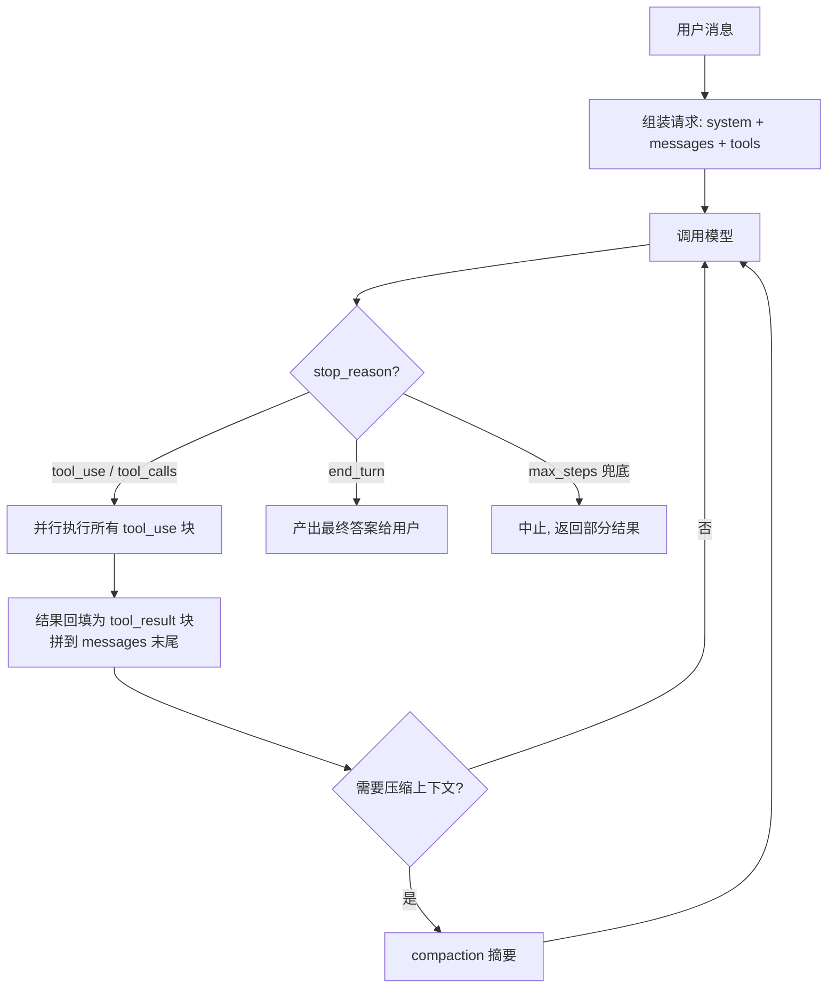
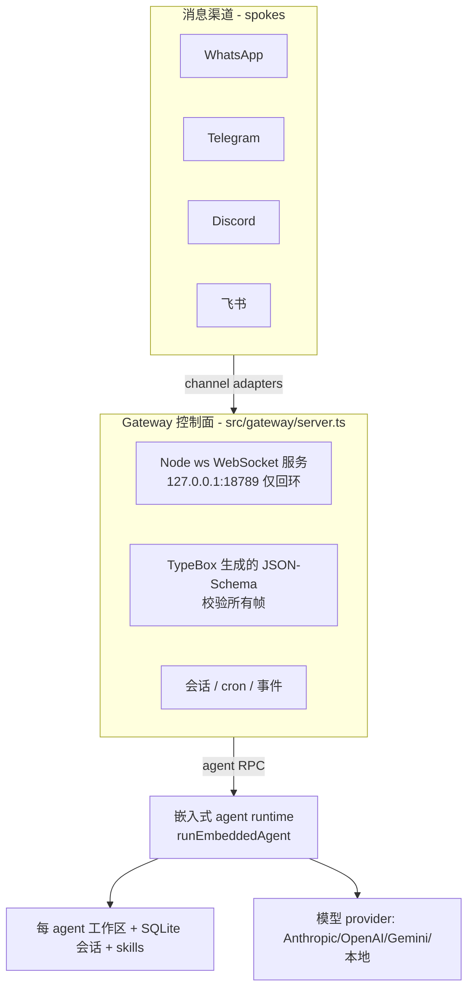

# 主流 Agent 架构调研与原理分析

> 目的：在动手自研之前，先把市面上主流 Agent 的架构与原理吃透。本文横向剖析 **Claude Code、OpenAI Codex CLI、OpenClaw、Hermes Agent** 四款代表性产品，再抽取出跨产品的**通用架构原理**，最后沉淀一份**可复用工程决策清单**，作为我们自研 agent（TS/Node，通用任务型，可插拔多后端）的设计依据。
>
> 配套文档：自研架构设计与分阶段构建计划见 [`our-agent-design.md`](./our-agent-design.md)。
>
> 调研时间：2026-07。**置信度标注**：Claude Code / Codex CLI / 通用原理均锚定官方一手文档与源码，置信度高；OpenClaw / Hermes Agent 部分事实来自网络二手资料（含 SEO 内容），架构层面的模式可靠，但具体版本号、star 数、时间线仅供参考。

---

## 0. TL;DR — 一页看懂

**一句话定义**：Agent = 把「下一步做什么」的控制流交给模型自己决定的系统。你在 workflow 里写死分支；在 agent 里只暴露工具，由模型在运行时选择下一步动作。

**所有 agent 的共同内核**，就是一个围绕单次模型对话的 **while 循环**（源自 2022 年的 ReAct）：

```
收集上下文 → 调模型 → 模型要求调工具？
   ├─ 是：并行执行工具 → 结果回填为 tool_result → 继续循环
   └─ 否（end_turn）：产出最终答案 → 结束
```

**四款产品的定位差异**：

| 产品 | 本质 | 语言 | 最锋利的差异点 |
|---|---|---|---|
| **Claude Code** | 终端编码 agent（= Agent SDK loop + TUI） | TS/Node | **prompt caching 是一切**；hooks/permissions 在 harness 层强制 |
| **Codex CLI** | 终端编码 agent | Rust 核心 + TS 启动器 | **OS 内核级 sandbox**；SQ/EQ 队列解耦 UI 与引擎 |
| **OpenClaw** | 本地优先的**个人通用助理** | TS/Node | Gateway 单一控制面；三层安全模型；连接 20+ 消息渠道 |
| **Hermes Agent** | 自托管**通用 agent 运行时** | Python | `(provider,model)` resolver + 三种 wire-format；插件化 provider/memory |

**给我们自研的 5 条最高优先级启示**（详见 §5）：
1. loop 保持"笨"且单线程，用 `stop_reason` 终止 + `maxSteps` 兜底；
2. 请求按「稳定前缀 → 项目上下文 → 易变对话」分层，为 prompt caching 服务；
3. 每个工具**内置结果大小限制**（分页/截断/溢出到文件）——填爆上下文的是工具输出，不是用户输入；
4. 权限用**独立的 harness 层**强制（deny→ask→allow），不要指望 prompt 约束；
5. provider 抽象层归一化两处差异：`stop_reason` 命名 + tool_result 回填方式。

---

## 1. 概念对齐：什么是 Agent

### 1.1 Workflow vs Agent

各大厂定义已收敛（[Anthropic《Building effective agents》](https://www.anthropic.com/engineering/building-effective-agents)）：

- **Workflow**：LLM 和工具通过**预先写死的代码路径**编排。可预测、可控。
- **Agent**：LLM **动态决定自己的流程和工具调用**，自主掌控如何完成任务。

OpenAI 的说法一致：agent 是"能代表你独立完成任务的系统"，并明确把"简单聊天机器人、单轮 LLM、情感分类器"排除在外——因为它们没有用 LLM 来**控制工作流的执行**（[OpenAI《A practical guide to building agents》](https://cdn.openai.com/business-guides-and-resources/a-practical-guide-to-building-agents.pdf)）。

> **工程结论**：agent 的本质是「把控制流决策委托给模型」。两者都要会建，原则是**先用能解决问题的最简方案**——agentic 系统是拿延迟和成本换任务表现。先把单 agent 能力做到极致，再考虑多 agent。

### 1.2 底层积木：Augmented LLM

无论 workflow 还是 agent，最底层都是**增强型 LLM**：一个带了检索、工具、记忆的模型，由模型自己生成查询、选择工具、决定保留什么。

### 1.3 思想源头：ReAct

主流 loop 是 [ReAct（Yao et al., 2022）](https://arxiv.org/abs/2210.03629) 的直系后代，交替进行**推理（Thought）→ 行动（Action）→ 观察（Observation）**：

- 推理帮助模型归纳/追踪/更新计划、处理异常；
- 行动让模型接入外部世界，注入真实观察、降低幻觉。

现代 API 已经把 ReAct 训练进模型的 tool-calling 能力里，你几乎不用手写 `Thought:/Action:` 了——但**心智模型仍然是 ReAct：loop 就是 agent**。

---

## 2. 核心原理：Agent Loop

### 2.1 循环结构



Anthropic 把这个循环概括为三段式：**收集上下文 → 采取行动 → 验证工作**（[Building agents with the Claude Agent SDK](https://claude.com/blog/building-agents-with-the-claude-agent-sdk)）。相比裸 ReAct，关键增量是显式的 **verify（验证）** 阶段——用编译器/linter/测试给模型**真实的环境反馈**，让它自我纠错，而不是相信一次就对。

### 2.2 Turn vs Step（实现时必须区分清楚）

- **Turn（轮）**：一次模型推理（一个请求 → 一条 assistant 消息）。一个 assistant turn 可以同时包含推理文本**和**多个 tool_use 块。想调工具的 turn 以 `stop_reason: "tool_use"` 结束。
- **Step（步）**：一次完整的循环迭代 = `模型 turn → 执行工具 → 回填结果 → 下一个模型 turn`。一个 step 可以执行多个工具（并行工具调用）。

例：`用户消息 → [step1: assistant 带 2 个工具调用 → 2 个结果] → [step2: assistant 带 1 个工具调用 → 1 个结果] → [step3: assistant 纯文本，无工具 = 完成]`。

### 2.3 终止条件（必须有硬停止）

1. **本 turn 无工具调用**——模型返回纯文本（Claude: `end_turn`；OpenAI: 无 `tool_calls`）。这是正常的"任务完成"信号。
2. **调用了指定的 final-output 工具** / 产出了预期类型的结构化输出。
3. **达到 max_steps / maxTurns**（安全上限，永远要设）。
4. **错误/失败阈值**超限。
5. **移交（handoff）**给人或其他 agent。

> **恢复优于崩溃**：单个工具报错时，把错误**作为 tool_result（带 error 标记）回填**给模型，让它自己恢复，而不是让整个 loop 抛异常挂掉。

### 2.4 各产品如何实现这个循环

- **Claude Code**：单线程、有状态的 `while (stop_reason === "tool_use")`。上层叠加 `maxTurns` 硬上限、Stop 钩子、以及会话级配额（如每会话 200 次 WebSearch）。一个被广泛引用的第三方拆解称其为"简单的单线程主循环 + 有纪律的工具和规划 = 可控的自主性"，loop 本身很小，大部分代码在周边子系统（安全、上下文管理、委派、持久化）。
- **Codex CLI**：结构化为 **Session → Task → Turn**。一个 Session 最多同时跑一个 Task；Task 由一串 Turn 组成；"一个 Turn 的输出是下一个 Turn 的输入"，某个 Turn 无输出则 Task 终止。
- **Hermes Agent**：`AIAgent.run_conversation()` 同步循环，带预算追踪和中断检查：`while api_call_count < max_iterations and budget.remaining > 0`。
- **OpenClaw**：文档化的 5 阶段（Gateway 校验 → Turn 执行 → 嵌入式 runtime → 事件桥接 → 完成等待），并有 `NO_REPLY` 静默约定——模型可以合法选择"这轮不回复"（常驻型助理必需）。

---

## 3. 四款主流 Agent 横向对比

### 3.1 总览对比表

| 维度 | Claude Code | Codex CLI | OpenClaw | Hermes Agent |
|---|---|---|---|---|
| **定位** | 终端编码 agent | 终端编码 agent | 本地优先个人通用助理 | 自托管通用 agent 运行时 |
| **实现语言** | TypeScript / Node | Rust 核心 + TS 启动器 | TypeScript / Node（pnpm monorepo） | Python |
| **循环模型** | `while stop_reason==tool_use` 单线程 | Session→Task→Turn，SQ/EQ 队列 | 5 阶段，Gateway + 嵌入式 runtime | `run_conversation()` 同步循环 + 预算 |
| **模型协议** | Anthropic Messages（+prompt caching） | **仅** Responses API，`previous_response_id` 传状态 | 可插拔 `provider/model` 字符串 | `(provider,model)` resolver + 3 种 wire-format |
| **多后端** | 主 Claude（SDK 可扩展） | 内置 openai/ollama/lmstudio/bedrock | Anthropic/OpenAI/Gemini/本地 | **18+ provider**，OAuth/凭证池 |
| **工具系统** | Read/Edit/Write/Bash/Glob/Grep/Agent/Web… | shell/apply_patch(Lark 语法约束)/plan/mcp… | exec/read/write/edit/browser/message… | terminal/patch/execute_code(RPC)… ~70+ |
| **工具扩展** | MCP（默认延迟加载 tool search） | MCP client+server + tool_search | MCP + 插件 + skills + ClawHub | MCP + 插件 + skills(agentskills.io) |
| **上下文/记忆** | CLAUDE.md 层级 + 自动 compaction + 自动记忆 | AGENTS.md 链（32KiB）+ rollout 文件 | Bootstrap MD 文件 + SQLite 事件日志 + 向量+BM25 混合检索 | 分层 system prompt + SQLite FTS5 会话 |
| **子代理** | Agent/Task 工具，后台并发，Workflow 编排 | multi_agents 工具 | subagents + 按渠道隔离的多 agent | delegate_task，深度/并发上限 |
| **权限/安全** | 权限模式 + deny→ask→allow + hooks | **OS 内核级 sandbox** + approval 两层正交 | 三层：sandbox / tool-policy / elevated | 6 种执行后端隔离 |
| **会话持久化** | 会话文件 + /rewind + /compact | append-only rollout JSONL + 压缩 | SQLite append-only 事件日志（可分支） | SQLite FTS5 + lineage 追踪 |

### 3.2 Claude Code — "prompt caching 是一切"

**核心洞察**：Claude Code 本质就是 Agent SDK 的 loop + 一个终端 UI。官方原话："Agent SDK 提供了驱动 Claude Code 的同一套工具、agent loop 和上下文管理，可用 Python/TS 编程。"所以 [SDK 文档](https://code.claude.com/docs/en/agent-sdk/overview) 就是它的架构规范。

最值得学的几点：

1. **请求分三层，为前缀缓存服务**（[prompt caching 文档](https://code.claude.com/docs/en/prompt-caching)）。每轮都重发全部上下文（模型无状态），但顺序固定：

   | 层 | 内容 | 何时失效 |
   |---|---|---|
   | System prompt | 核心指令、**工具定义**、output style | 工具集变化或 CC 升级 |
   | 项目上下文 | CLAUDE.md、自动记忆、无作用域 rules | 会话开始、`/clear`、`/compact` |
   | 对话 | 用户消息、模型回复、工具结果 | 每轮 |

   缓存是**前缀精确匹配**：任何位置改动都会让其后全部失效；`cache_read` 只按标准输入价的 ~10% 计费。由此派生出一系列刻意设计：**plan 模式和 skill 加载都作为对话消息追加**（而非改 system prompt），**MCP 工具延迟加载**（schema 不进缓存前缀），**会话中途改 CLAUDE.md 故意无效**（改了会让缓存失效）。

2. **工具内置结果大小纪律**：Bash 输出 >30k 字符溢出到文件只返回预览；Read 分页；Grep/Glob 截断并打标记；大图片重压缩。**填爆上下文的是工具输出**。

3. **Just-in-time 检索对抗 context rot**：少量持久上下文（CLAUDE.md）预先塞入，其余用 grep/glob 按需即时拉取。

4. **子代理做上下文隔离**：research 子代理可以读 6000+ token 文件，只把 420 token 摘要返回给父。硬约束：**父传给子的唯一通道就是 prompt 字符串**（子代理拿不到父的对话历史）。

5. **两层强制**：CLAUDE.md 是"建议性"的（模型尽量遵守但无保证）；**hooks/permissions 是硬性的**，由 harness 而非模型强制。要硬约束就用 hooks，别写在 prompt 里。

### 3.3 OpenAI Codex CLI — OS 内核级 sandbox

**核心洞察**：把整个 agent 编译成 Rust 单二进制（Linux 用 musl 静态链接），外面套一层薄薄的 TS 启动器（`@openai/codex` npm 包）。2025 年 4 月首发是 TS/Node，后来重写为 Rust，为的是甩掉 Node 运行时依赖和长驻进程的 GC 延迟，并支持单二进制分发和 **OS 级 sandbox**。

最值得学的几点：

1. **sandbox 与 approval 两层正交**（这是它最锋利的差异点）：
   - **sandbox 模式** = 技术上"能做什么"：`read-only` / `workspace-write`（默认）/ `danger-full-access`。即使在可写根内，`.git` 和 `.codex` 也保持只读（防提权）。
   - **approval 策略** = "何时必须问你"：`untrusted` / `on-request`（默认）/ `never` / `granular`（按类别细粒度布尔）。
   - **OS 内核级强制**：macOS 用 Seatbelt（`sandbox-exec`），Linux 用 `bwrap`+`seccomp`（旧路径 Landlock），Windows 用受限令牌后端。策略若需弱化强制则 **fail closed（失败即拒）**。这比 Claude Code 的 hook/prompt 层权限更硬。

2. **SQ/EQ 队列对解耦 UI 与引擎**：核心引擎 `Codex` 通过 **Submission Queue（Op）** 和 **Event Queue（EventMsg）** 与任意 UI 通信。传输层可以是 channel/stdio JSON-RPC/TCP/gRPC——于是 TUI、IDE 插件、SDK、`codex mcp` 都是同一引擎的瘦客户端。**非常值得模仿的解耦模式。**

3. **apply_patch 用 Lark 语法约束的 freeform 工具**：模型必须吐出合法的 `*** Begin Patch … *** End Patch` 补丁信封，同一个二进制还能当 apply_patch CLI 用。对比 Claude Code 的专用 Edit/Write 工具，这是另一条路线。

4. **execpolicy 允许列表 + amendments**：声明式的"已知安全命令"规则集，批准后可存成 session amendment，未来匹配命令免提示——比纯逐次提示更可审计。

5. **AGENTS.md（厂商中立开放标准）** vs CLAUDE.md：嵌套按目录优先级，32KiB 预算，root-first 拼接、近 cwd 者覆盖。

6. **rollout 文件持久化**：append-only JSONL + 后台压缩 worker + 引用索引，可 resume / fork。比数据库更简单可移植。

### 3.4 OpenClaw — Gateway 控制面 + 三层安全

> 置信度：架构模式来自 `docs.openclaw.ai` 与 GitHub 一手源；项目起源/时间线来自二手资料，仅作背景。

**核心洞察**：不是编码 agent，而是**跑在你自己机器上的个人通用助理**——连接你的即时通讯 app（WhatsApp/Telegram/Discord/Slack/飞书/微信 等 20+），真正代你执行动作（文件/浏览器/shell/集成）。恰恰因为是通用型，它对我们"通用任务 agent"目标参考价值很大。

本地优先的**中心辐射（hub-and-spoke）**结构：



最值得学的几点：

1. **Gateway 作为单一类型化控制面**：一个长驻 Node `ws` 服务，仅回环，一机一个；**所有 WebSocket 帧用 TypeBox 生成的 JSON Schema 校验**——编译期和运行期用同一份定义，端到端类型安全。
2. **异步 run 句柄 + 事件流**：`agent` RPC 立即返回 `{runId, acceptedAt}`，再桥接 `tool` / `assistant` / `lifecycle` 三条事件流，`agent.wait` 供想阻塞者用。干净地把"启动一次 run"和"观察一次 run"分开。
3. **按 session 的串行队列（session lanes）**：按 sessionKey 串行化消除工具/会话竞态；session 写锁保护 transcript。不用重数据库就拿到并发正确性。
4. **SQLite append-only 事件日志会话（可分支）**：便宜、本地、可检查、可恢复。
5. **prompt 由小的可编辑 Markdown 文件组合**（`AGENTS.md`/`SOUL.md`/`USER.md`/`MEMORY.md`…），空文件跳过、大文件截断留标记。把人格/指令/工具/记忆拆成独立可编辑单元。
6. **skills ≠ tools + 按需只注入相关的 + meta-search 工具**（`tool_search`/`tool_describe`）：对付"工具/技能太多撑爆上下文"的可扩展答案。
7. **三层安全正交**：sandbox（代码在哪跑，默认非主会话才容器化）/ tool-policy（**deny 永远赢**，能调什么）/ elevated（只放 `exec` 逃逸到宿主的窄口子）。配合**每个副作用操作都要幂等键**、**入站默认不可信（配对码）**、**结构化分隔防注入**。
8. **一条反面教训**：早期 MCP 工具**绕过了** tool-policy 门。教训：从第一天起就把**所有工具来源（内置/插件/MCP）走同一条 allow/deny 管道**。

### 3.5 Hermes Agent — 可插拔后端的最佳参考

> 置信度：来自 GitHub 仓库与官方文档，部分实现细节（LOC/版本号）来自二手，架构模式可靠。

**核心洞察**：Nous Research 的自托管通用 agent 运行时，与 Claude Code/Codex 同类。**它的 provider 抽象是我们"可插拔多后端"目标最直接的参考。**

最值得学的几点：

1. **`(provider, model)` resolver + 三种 wire-format 模式**（★对我们最关键）：一个共享 resolver 把 `(provider, model)` 映射到运行时凭证，覆盖 18+ provider；用三种 API 模式抽象各家线格式：`chat_completions` / `codex_responses` / `anthropic_messages`。**这就是让同一个 agent loop 能驱动 OpenAI 式、Codex/Responses 式、Anthropic 式后端的关键接缝。**
2. **import-time 工具注册 + `check_fn` 可用性门控**：工具在导入时自注册（先于 agent 实例）；每个工具声明 JSON schema、handler、可用性 `check_fn`、所需 env var——**服务未配置的工具不出现**，保持工具集精简。所有 handler 必须返回 JSON 字符串。
3. **插件模式统一用于 provider 和 memory**：懒发现、last-writer-wins 覆盖。memory 后端可插拔（honcho/mem0/supermemory…），生命周期钩子 `sync_turn/prefetch/post_setup/shutdown`。
4. **`execute_code` 作为力量倍增器**：agent 写一段 Python 脚本，通过 **RPC 调用其它工具**，"把多步流水线压缩成零上下文成本的一轮"——编排发生在一次推理内，而非多次工具往返。
5. **skills 作为 cache-safe 的 user 消息注入**（而非改 system prompt），以保住 prompt caching。"prompt caching is sacred"是明确的设计约束。
6. **子代理 delegate_task**：单个或批量并行（默认并发 3），child 分 `leaf`（不能递归）/ `orchestrator`（可派生，受深度上限）。
7. **footprint 阶梯**（扩展时的偏好顺序）：扩展现有代码 → CLI 命令+skill → 服务门控工具 → 插件 → MCP server → 新核心工具（最后手段）。核心工具每次 API 调用都发送，所以加一个核心工具的门槛很高。

若搭配开源模型，Hermes 4 **模型**的函数调用格式（`<tools>` 放 schema、`<tool_call>` 发起、`<tool_response>` 回填、`<think>` 可选推理）刻意贴近 OpenAI 约定，流式友好。

---

## 4. 六大子系统深度剖析（横切主题）

### 4.1 工具系统 / Function Calling

**线格式各家几乎一致，只是字段名不同**：

- **工具声明** = `name` + 自然语言 `description` + **JSON Schema 输入**（Anthropic 叫 `input_schema`，OpenAI 叫 `parameters`）。
- **description 是 prompt engineering，不是文档**——模型靠它路由。最大失败模式是"臃肿/重叠的工具集造成模糊决策点"。OpenAI 观察：有的团队 15+ 工具运转良好，有的不到 10 个重叠工具就崩——**杀手是重叠，不是数量**。
- **往返**：模型吐 `tool_use` 块（带 `id`）→ 你执行 → 你把 `tool_result`（keyed by `tool_use_id`）拼进 user 消息 → 再调模型。
- **并行工具调用**：单个 turn 可吐多个 tool_use 块，并发执行、一次性回填。**这是 agent 最大的单点延迟杠杆**（Anthropic research 系统靠它等把研究时间砍了 ~90%）。你的工具执行器要 async，对一个 turn 内所有 tool_use 块 fan-out、全部 await 后再调下一次模型。
- **strict 模式 / 结构化输出**：约束解码保证参数符合 schema，也能把**最终答案**逼成类型化结构，作为干净的终止信号。用 Zod 从同一份定义生成运行期校验器和模型侧 schema，二者不脱节。

### 4.2 上下文工程（Context Engineering）

Anthropic 称之为"prompt engineering 的自然演进"——从写指令，变成"在推理时策展和维护那组最优 token"。

- **上下文是有限资源，有边际递减**。模型有有限的"注意力预算"，每 token 都在消耗它。
- **Context rot（上下文腐烂）**：token 越多，模型精确回忆信息的能力越差。机制上是 transformer 注意力的 n² 两两关系被摊薄 + 训练数据偏短序列。**更大的窗口不能替代上下文管理；更多 token ≠ 更好，往往更差。**
- **窗口管理四招**（都值得实现）：
  1. **Compaction/摘要**：接近上限时摘要并重开窗口。难点在"保留什么 vs 丢什么"——过度压缩会丢失微妙但关键的上下文。Claude Code 的 compaction 保留：用户意图、关键技术概念、查看/修改的文件+重要片段、错误及修复、待办、当前工作；丢弃完整工具输出和中间推理。
  2. **结构化记笔记（外部记忆）**：agent 把笔记持久化到窗口外，之后再拉回。文件系统本身就是记忆——"agent 的文件夹和文件结构就是一种上下文工程"。
  3. **Just-in-time 检索**：保留轻量标识符（文件路径、查询、链接），运行时按需加载，模拟人类认知。
  4. **子代理上下文隔离**：专门子代理用干净窗口处理聚焦任务，只回传 ~1-2k token 摘要。
- **记忆分层**（Lilian Weng 经典框架 → LangGraph 落地）：**短期记忆 = 线程作用域状态**（checkpointer，按 `threadId`）；**长期记忆 = 跨线程共享**（store，namespace 化、embedding 支持）。这是我们最干净的架构接缝。

### 4.3 规划模式（Planning）

按复杂度递增：
- **分解 / CoT**：一步步拆；Tree of Thoughts 在每步探索多个分支并投票评估。
- **Plan-and-execute**：先出计划，再执行，边观察边重规划。对应 orchestrator 模式。
- **反思 / 自我批评**：Reflexion 给 agent 动态记忆和自省，把反思折进工作记忆再重试。产品化形态是 evaluator-optimizer（一个生成、一个批评）和 Agent SDK 的 verify 阶段——**基于规则的反馈（说清哪条规则失败、为什么）比 LLM-as-judge 更鲁棒**。
- **Todo 列表 / 外部化计划**（★高性价比）：让 agent 维护一个持久 todo/scratchpad，使计划能熬过 compaction。实现极便宜（一个读写 `todo.md` 的工具），对多步任务效果不成比例地好。

### 4.4 多智能体 / 编排

**两大拓扑**（OpenAI 归纳）：
1. **Manager（agents-as-tools）**：中央 manager 通过工具调用协调专门 agent 并综合结果。边 = 工具调用。适合"只让一个 agent 掌控流程并接触用户"。Anthropic 的 research 系统就是这个模式的参考实现（orchestrator-worker）。
2. **Decentralized（handoffs）**：对等 agent 互相移交执行（单向转移 + 转移对话状态）。适合不需要中央综合的场景（分诊 → 专家）。边 = handoff。

**子代理为什么有用——两个不同原因（别混淆）**：
- **并行化**（吞吐/延迟）：并发扇出独立探索。
- **上下文隔离**（质量）：子代理用自己的隔离窗口，只回传相关信息，防止上下文膨胀，且"不同工具/prompt/探索轨迹"减少路径依赖。

**何时多 agent 会伤害你 + 经济学**：多 agent 系统**用 token 约为聊天的 15×**，token 用量单独就解释了 ~80% 的表现方差。所以只在"任务价值高到值得为额外表现买单"时才用。它擅长重并行、超单窗口的信息量、接大量复杂工具；但**不适合需要紧密共享上下文或实时协调**的任务——"大多数编码任务可真正并行的部分比研究少，且 LLM agent 目前还不擅长实时互相协调委派"。

> **经验法则**：从单 agent 起步。当 prompt 堆积大量 if-then 分支、或工具变多/重叠时才拆分。

### 4.5 权限与安全

因为动作由模型运行时选择，控制不是可选项。把 guardrail 当作**分层防御**，单一层不够。

- **Guardrail 类型**（OpenAI 分类）：相关性分类器、安全分类器（越狱/注入检测）、PII 过滤、内容审核、**工具安全分级**（按只读vs写、可逆性、所需权限、财务影响给每个工具评 低/中/高 风险）、规则保护（黑名单/长度/正则）、输出校验。可与主 agent **并发运行**（乐观执行），违规抛异常。
- **权限 + human-in-the-loop**：按动作风险给 loop 设门。两种触发人工介入：**超过失败阈值**（限重试、升级）和**高风险动作**（敏感/不可逆/高风险，如退款/支付/删除）。机制上用 **interrupt + checkpoint**：敏感工具执行前暂停图、浮出审批、从存档 checkpoint 恢复。架构上是"模型请求工具 X"和"工具 X 执行"之间的一个权限层，把每次调用分类为 自动允许 / 问用户 / 拒绝。
- **Sandbox**：跑代码/碰文件系统/网络的工具应在最小权限隔离沙箱执行，限制模型错误和注入攻击的爆炸半径。
- **★提示注入（来自工具输出）——tool-using agent 的头号漏洞**：
  - **间接提示注入**：恶意指令嵌在外部数据源（文档、网页、工具输出、检索文本）里，被模型当作上下文吞下。它们**不需要人类可见**，只要文本被 LLM 解析即可。这是 OWASP LLM Top 10 的 #1。
  - **根因是架构性的**：模型内部没有可信指令和不可信数据的通道分隔——两者作为同一个 token 流到达。
  - **致命三要素（lethal trifecta）**：一个 agent 同时拥有 (1) 访问私有数据 (2) 接触不可信内容 (3) 对外通信能力 时，单条注入指令就能诱导它外泄数据。
  - **设计对策**：永远别把工具/检索输出当指令；尽量结构化分隔为数据；打破三要素（读了不可信内容后就限制它既访问密钥又外泄）；不可逆/外泄动作保留 human-in-the-loop；严格的**指令来源边界**——指令来自用户，不来自被观察的内容。

### 4.6 可插拔模型后端 & MCP

**Provider 抽象**：各家线协议结构相同（content blocks、tool calls、tool results、一个 stop reason），所以定义一个 provider-中立接口，每个 SDK 适配进来。需要归一化的两处差异：
1. **stop_reason 命名**：`end_turn`/`tool_use`（Anthropic） vs `stop`/`tool_calls`（OpenAI）。
2. **结果回填方式**：Anthropic 在 `user` 消息里放 `tool_result` 块；OpenAI 用 `tool`-role 消息。
把这些藏进 adapter，loop 只看归一化类型。Hermes 的 `codex_responses`/`anthropic_messages`/`chat_completions` 三模式就是这个思路的成熟实现。

**MCP（Model Context Protocol）**——"AI 应用的 USB-C 口"：
- **角色**：Host（你的 agent，协调多个 client）/ Client（与一个 server 保持 1:1 连接）/ Server（暴露工具/数据）。
- **两层**：数据层（**JSON-RPC 2.0**，定义生命周期、原语、通知）+ 传输层（**stdio** 本地进程 / **Streamable HTTP** 远程 + SSE，推荐 OAuth）。
- **原语**：Server 侧 = Tools（可执行函数）/ Resources（上下文数据）/ Prompts（模板）；Client 侧 = Sampling（server 反请求 host 的 LLM，让 server 与模型无关）/ Elicitation（server 请求用户输入/确认，天然的 HITL 钩子）/ Logging。
- **关键**：MCP 工具定义带的正是 `name`/`description`/`inputSchema`——client `tools/list` 拉回来就能直接注册进模型的 tool 数组。有状态协议，`initialize` 握手协商能力；server 可推 `notifications/tools/list_changed` 让 client 重拉、模型可用工具中途更新。
- **对可插拔生态是关键一招**：说 MCP 就继承整个生态（文件系统、GitHub、数据库…），无需为每个工具手写 adapter。
- **注意**：MCP 极大扩大不可信内容面（任何第三方 server 都能往你上下文里塞文本），对所有 MCP 工具输出套用 §4.5 的注入防御。

---

## 5. 可复用工程决策清单（Do's）

给我们自研 agent 的可执行结论，按优先级：

- [ ] **1. loop 保持笨、单线程**。`while stop_reason==tool_use` + `maxSteps` 硬上限 + 可选的编程式停止条件（测试/linter 通过）。别过度设计编排。
- [ ] **2. 从第一天起为前缀缓存组织请求**。固定 system+tools 在前，项目上下文居中，易变对话在后。永远别为了美观在中途改前缀，只 append。这是最大的成本/延迟胜利。
- [ ] **3. 每个工具内置结果大小限制**。分页读、截断搜索结果并打标记、大命令输出溢出到文件只返回预览。
- [ ] **4. 少而锋利的工具 + 代码执行 > 大量窄工具**。臃肿/重叠制造模糊决策点；agentic grep/glob + bash 廉价覆盖巨大面。
- [ ] **5. Just-in-time 检索 > 预加载**。少量持久上下文（CLAUDE.md 类比）+ 按需拉文件。对抗 context rot。
- [ ] **6. 子代理做上下文隔离，不只是并行**。硬约束：唯一入口是 prompt 字符串。
- [ ] **7. Compaction 作为一等公民**。接近上限自动摘要（保留意图/决策/文件/错误/待办），之后从磁盘重新注入持久指令。给用户手动 `/compact`、`/clear`、`/rewind`。
- [ ] **8. 两层强制：建议层（prompt/记忆） vs 硬层（hooks/permissions）**，由 harness 而非模型强制。每个副作用工具都过门（deny→ask→allow），只读操作零摩擦。安全关键规则写进代码，绝不写进 prompt。
- [ ] **9. 验证循环闭环 agent**。把编译器/linter/测试反馈作为 tool_result 回填，让模型自我纠正。规则反馈比 LLM-judge 鲁棒。
- [ ] **10. 把来自工具输出的提示注入当真实威胁**。回填前扫描/中和指令形状内容。打破致命三要素。
- [ ] **11. 延迟外部工具 schema（MCP 式）**。前面只加载工具名，按需拉完整 schema——保持缓存前缀稳定，可扩展到数百工具。
- [ ] **12. UI-agnostic 引擎 + 事件流**（Codex/OpenClaw 模式）。引擎通过 Op/Event 序列化流与任意前端解耦；`run` 立即返回句柄 + 三条事件流。
- [ ] **13. Provider 抽象归一化 stop_reason 和 tool_result 回填两处差异**（Hermes 三 wire-format 模式）。
- [ ] **14. append-only 事件日志会话持久化**（SQLite 或 JSONL），可 resume/fork。
- [ ] **15. 所有工具来源（内置/插件/MCP）走同一条权限管道**（OpenClaw 的反面教训）。

---

## 6. 关键差异与路线抉择（我们要做的取舍）

| 抉择点 | 选项 A | 选项 B | 我们的倾向 |
|---|---|---|---|
| 模型协议 | Responses API（Codex，服务端存状态，绑 OpenAI） | 每轮重发全历史（Claude/通用，可移植） | **B**——通用+可插拔目标要可移植；配 prompt caching |
| 编辑文件 | 语法约束 apply_patch（Codex） | 专用 Edit/Write 工具（Claude Code） | 通用 agent 先做通用 fs 工具，patch 后续 |
| Sandbox | OS 内核级（Codex，需 Rust/外部进程） | 权限层 + 可选容器（Claude/OpenClaw） | **B 起步**——TS/Node 里 shell 出 bwrap/容器为进阶 |
| 会话状态 | 数据库 | append-only JSONL/SQLite 事件日志 | **事件日志**——简单可移植可分支 |
| UI 耦合 | 引擎内嵌 UI | Op/Event 队列解耦 | **解耦**——为将来 TUI/IDE/API 多前端 |

---

## 7. 参考来源（一手为主）

**Claude Code / Anthropic**
- [Agent SDK overview](https://code.claude.com/docs/en/agent-sdk/overview) · [Subagents](https://code.claude.com/docs/en/agent-sdk/subagents) · [Tools reference](https://code.claude.com/docs/en/tools-reference) · [Permissions](https://code.claude.com/docs/en/permissions) · [MCP](https://code.claude.com/docs/en/mcp) · [Memory](https://code.claude.com/docs/en/memory) · [Context window](https://code.claude.com/docs/en/context-window) · [Prompt caching](https://code.claude.com/docs/en/prompt-caching)
- [Building effective agents](https://www.anthropic.com/engineering/building-effective-agents) · [Effective context engineering](https://www.anthropic.com/engineering/effective-context-engineering-for-ai-agents) · [Building agents with the Claude Agent SDK](https://claude.com/blog/building-agents-with-the-claude-agent-sdk) · [Multi-agent research system](https://www.anthropic.com/engineering/multi-agent-research-system) · [Prompt caching is everything](https://claude.com/blog/lessons-from-building-claude-code-prompt-caching-is-everything)

**OpenAI Codex CLI**
- [openai/codex GitHub](https://github.com/openai/codex) · [protocol_v1.md（SQ/EQ, Session/Task/Turn）](https://github.com/openai/codex/blob/main/codex-rs/docs/protocol_v1.md) · [core/README.md（sandbox/apply_patch）](https://github.com/openai/codex/blob/main/codex-rs/core/README.md) · [protocol.rs（approval/sandbox 枚举）](https://github.com/openai/codex/blob/main/codex-rs/protocol/src/protocol.rs)
- [Agent approvals & security](https://learn.chatgpt.com/docs/agent-approvals-security) · [AGENTS.md](https://learn.chatgpt.com/docs/agent-configuration/agents-md) · [Config reference](https://learn.chatgpt.com/docs/config-file/config-reference)

**OpenClaw**（一手：docs.openclaw.ai + GitHub）
- [openclaw/openclaw](https://github.com/openclaw/openclaw) · [Agent loop](https://docs.openclaw.ai/concepts/agent-loop) · [Agent runtime](https://docs.openclaw.ai/concepts/agent) · [Tools](https://docs.openclaw.ai/tools) · [Sandbox vs tool policy vs elevated](https://docs.openclaw.ai/gateway/sandbox-vs-tool-policy-vs-elevated)

**Hermes**（Nous Research）
- [Hermes Agent 官网](https://hermes-agent.nousresearch.com/) · [架构文档](https://hermes-agent.nousresearch.com/docs/developer-guide/architecture) · [NousResearch/hermes-agent](https://github.com/NousResearch/hermes-agent) · [Hermes-4-70B 模型卡](https://huggingface.co/NousResearch/Hermes-4-70B)

**通用原理**
- [ReAct（arXiv:2210.03629）](https://arxiv.org/abs/2210.03629) · [Lilian Weng: LLM Powered Autonomous Agents](https://lilianweng.github.io/posts/2023-06-23-agent/) · [OpenAI: A practical guide to building agents](https://cdn.openai.com/business-guides-and-resources/a-practical-guide-to-building-agents.pdf) · [OpenAI: Function calling](https://developers.openai.com/api/docs/guides/function-calling)
- [MCP: Introduction](https://modelcontextprotocol.io/docs/getting-started/intro) · [MCP: Architecture](https://modelcontextprotocol.io/docs/learn/architecture) · [LangGraph: Persistence](https://docs.langchain.com/oss/python/langgraph/persistence) · [OWASP LLM01: Prompt Injection](https://genai.owasp.org/llmrisk/llm01-prompt-injection/)
