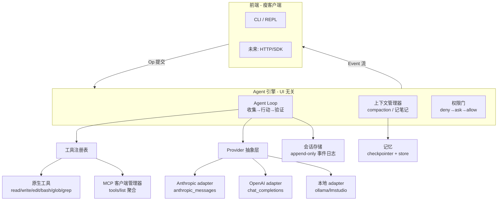

# super-agent 自研架构设计与分阶段构建计划

> 本文基于 [`agent-research.md`](./agent-research.md) 的调研结论，推导我们自研 agent 的架构。
>
> **目标画像**：TypeScript / Node · 通用任务型（ReAct/工具调用，不局限编码）· 可插拔多后端（Claude / OpenAI / 本地）· 学习驱动（每个阶段都能跑、都对应一组架构原理）。

---

## 1. 设计原则（从调研清单收敛）

1. **loop 笨且单线程**，`stop_reason` 终止 + `maxSteps` 兜底。
2. **provider 归一化**：loop 只见中立类型，各家差异藏进 adapter。
3. **请求分层**为 prompt caching 服务：`system+tools`（稳定）→ 项目上下文 → 易变对话。
4. **工具内置结果截断**，UI-agnostic 引擎 + 事件流。
5. **权限在 harness 层强制**（deny→ask→allow），不靠 prompt。
6. **把工具输出当不可信**，注入防御 + human-in-the-loop。
7. **能跑优先**：每阶段产出一个可运行的里程碑，边跑边学。

---

## 2. 分层架构



**分层职责**：

| 层 | 职责 | 对应调研启示 |
|---|---|---|
| 前端 | 采集用户输入、渲染事件流 | #12 UI-agnostic |
| 引擎 | loop / 上下文 / 权限 | #1 #7 #8 |
| 工具注册表 | 统一 name→{spec,handler,risk}，聚合原生+MCP | #4 #11 #15 |
| Provider 抽象 | 归一化各家线协议 | #2 #13 |
| 存储/记忆 | 事件日志会话 + 短/长期记忆 | #7 #14 |

---

## 3. 核心数据模型（TS）

采用 Anthropic 的 role + 有序 content blocks 模型（它干净地超集了 OpenAI）：

```ts
type Role = "user" | "assistant" | "system";

type ContentBlock =
  | { type: "text"; text: string }
  | { type: "thinking"; text: string }
  | { type: "tool_use"; id: string; name: string; input: unknown }
  | { type: "tool_result"; toolUseId: string; content: string | ContentBlock[]; isError?: boolean };

interface Message { role: Role; content: ContentBlock[]; }

type StopReason = "end_turn" | "tool_use" | "max_tokens" | "stop_sequence";

interface AssistantTurn {
  message: Message;
  stopReason: StopReason;
  usage: { inputTokens: number; outputTokens: number; cacheReadTokens?: number };
}

// 工具规格：name/description/inputSchema 即可直接喂给模型 & 从 MCP tools/list 注册
interface ToolSpec { name: string; description: string; inputSchema: object /* JSON Schema */; }
type Risk = "low" | "medium" | "high";
interface RegisteredTool {
  spec: ToolSpec;
  handler: (input: unknown, ctx: ToolContext) => Promise<ToolResult>;
  risk: Risk;               // 喂给权限门
  check?: () => boolean;    // Hermes 式可用性门控：未配置则不暴露
}
```

**Provider 中立接口**（关键接缝）：

```ts
interface ModelProvider {
  name: string;
  generate(req: GenerateRequest): Promise<AssistantTurn>;
  stream(req: GenerateRequest): AsyncIterable<StreamEvent>;
}
interface GenerateRequest {
  system?: string;
  messages: Message[];
  tools?: ToolSpec[];
  toolChoice?: "auto" | "required" | "none" | { name: string };
  maxTokens: number;
}
// adapter 内部归一化两处差异：
//  (1) stopReason 命名：end_turn/tool_use ↔ stop/tool_calls
//  (2) tool_result 回填：Anthropic 放 user 消息的 block ↔ OpenAI 用 tool-role 消息
```

**事件流**（前端/日志订阅，不耦合 provider）：
`turn_start` · `text_delta` · `thinking_delta` · `tool_call` · `tool_result` · `permission_request` · `step_complete` · `compaction` · `done` · `error`

---

## 4. Agent Loop 伪码（引擎核心）

```ts
async function run(messages: Message[], tools: RegisteredTool[], maxSteps = 20) {
  for (let step = 1; step <= maxSteps; step++) {
    emit("turn_start", { step });
    const turn = await provider.generate({
      system: buildSystemPrompt(),          // 稳定前缀，为 caching
      messages,
      tools: tools.map(t => t.spec),
    });
    messages.push(turn.message);

    if (turn.stopReason === "end_turn") {    // 终止条件 1
      emit("done"); return finalText(turn);
    }

    const calls = turn.message.content.filter(b => b.type === "tool_use");
    // 并行执行，每个都过权限门；错误回填而非抛出
    const results = await Promise.all(calls.map(c => runWithPermission(c, tools)));
    messages.push({ role: "user", content: results });   // tool_result 块
    emit("step_complete", { step });

    messages = await maybeCompact(messages);  // 接近上限则摘要
  }
  emit("error", { reason: "max_steps" });      // 终止条件 3：兜底
  return abort("reached max steps");
}

async function runWithPermission(call, tools) {
  const tool = tools.find(t => t.spec.name === call.name);
  const decision = permissionGate(tool.risk, call);  // deny→ask→allow
  if (decision === "deny")  return toolError(call, "denied by policy");
  if (decision === "ask")   await requestUserApproval(call);   // HITL
  try {
    const out = await tool.handler(call.input, ctx);
    return sanitize(truncate(out));            // 结果截断 + 注入中和
  } catch (e) {
    return toolError(call, String(e));         // 恢复优于崩溃
  }
}
```

---

## 5. 目录结构（TS/Node，pnpm）

```
super-agent/
├─ docs/                      # 调研 + 设计（本文档所在）
├─ src/
│  ├─ core/
│  │  ├─ loop.ts              # agent loop 引擎
│  │  ├─ types.ts             # Message/ContentBlock/AssistantTurn…
│  │  ├─ events.ts            # 事件流定义 + emitter
│  │  └─ context.ts           # compaction / 记笔记
│  ├─ providers/
│  │  ├─ provider.ts          # ModelProvider 接口
│  │  ├─ anthropic.ts         # anthropic_messages adapter
│  │  ├─ openai.ts            # chat_completions adapter
│  │  └─ local.ts             # ollama/lmstudio adapter
│  ├─ tools/
│  │  ├─ registry.ts          # 注册表 + check_fn 门控
│  │  ├─ fs.ts                # read/write/edit/glob/grep
│  │  ├─ bash.ts              # 命令执行 + 输出截断
│  │  └─ ...
│  ├─ permissions/
│  │  └─ gate.ts              # deny→ask→allow
│  ├─ mcp/
│  │  └─ client.ts            # MCP 客户端管理器
│  ├─ memory/
│  │  ├─ checkpointer.ts      # 短期：线程状态
│  │  └─ store.ts             # 长期：跨会话
│  ├─ session/
│  │  └─ rollout.ts           # append-only 事件日志
│  └─ cli/
│     └─ main.ts              # REPL 前端（瘦客户端）
├─ AGENTS.md                  # 项目指令（厂商中立标准）
├─ package.json
└─ tsconfig.json
```

---

## 6. 分阶段构建计划（每阶段一个可跑里程碑 + 一组原理）

| 阶段 | 交付里程碑 | 学到的原理 | 依赖 |
|---|---|---|---|
| **P1 骨架** | provider 抽象 + 消息模型 + 1 个工具，跑通**单步**工具调用 | 线协议、tool_use/tool_result 往返、JSON Schema | anthropic SDK |
| **P2 循环** | 带终止 + maxSteps 的 loop → 基础 ReAct agent，能连续调工具答题 | agent loop、turn/step、终止条件、错误恢复 | P1 |
| **P3 工具集** | 注册表 + 并行执行 + fs/bash/grep/glob + 结果截断 + 事件流 | 工具设计、并行调用、结果纪律、事件解耦 | P2 |
| **P4 上下文** | compaction + 记笔记工具（todo.md）+ 会话持久化 | context rot、compaction、外部记忆、事件日志 | P3 |
| **P5 安全** | 权限门（按 risk）+ HITL 审批 + 注入感知的工具输出处理 | 两层强制、deny→ask→allow、致命三要素 | P3 |
| **P6 多后端** | OpenAI + 本地 adapter，一份 loop 驱动三家 | wire-format 归一化、可插拔 | P1 |
| **P7 MCP** | MCP 客户端接入外部工具生态 | JSON-RPC、client/server、tools/list 聚合 | P3 |
| **P8 子代理** | orchestrator-worker（仅当真需要并行/隔离时） | 上下文隔离、编排、多 agent 经济学 | P4 |

**建议先做 P1→P2→P3**（拿到一个真能干活的通用 agent），再按兴趣切 P4/P5/P6。P7/P8 是进阶。

---

## 7. 开始 P1 需要确认的事

- **首个接入的模型/凭证**：当前环境有 Anthropic 访问（推荐 P1 用 Claude），需要确认用哪个 API key（环境变量注入，绝不写进代码）。
- **包管理器**：pnpm（对齐 OpenClaw）还是 npm？
- **运行时**：tsx 直跑 TS，还是 tsc 编译？（推荐 tsx 开发期直跑）
